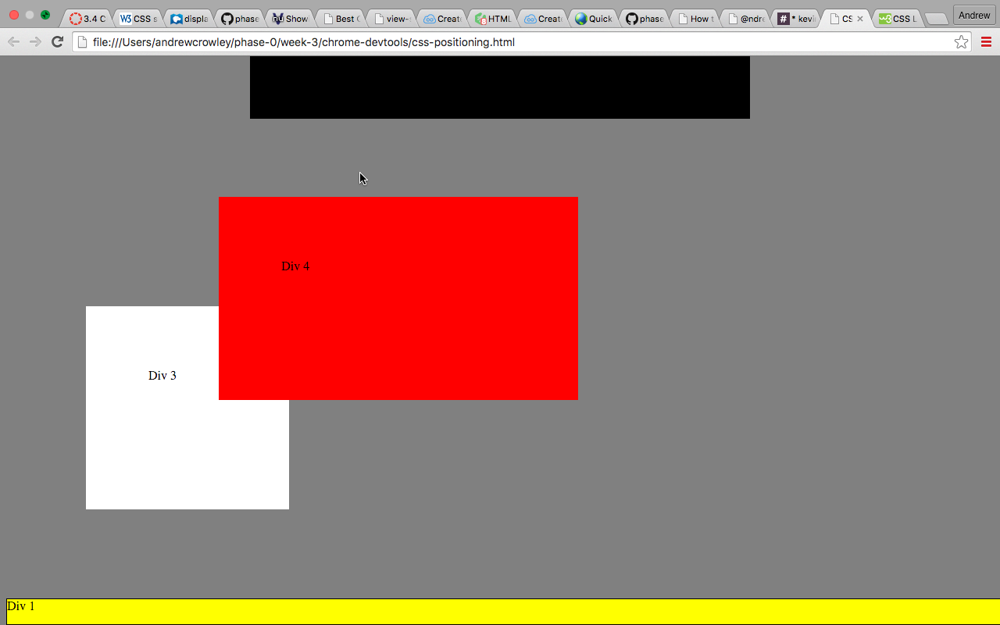

## How can you use Chrome's DevTools inspector to help you format or position elements?
Chrome’s Developer Tools are a set of code writing and debugging tools built into Google Chrome.  The inspector helps highlight each of the elements in the Document Object Model  (DOM) and shows their padding, margins, etc.  DevTools really helps formatting and positions by allowing you to live-edit the CSS and test different layouts on the fly.  

## How can you resize elements on the DOM using CSS?
By changing the padding you can resize an element with CSS.  Using either units of measurement (em, px) or percentages (padding can’t accept negative values) you can change the size of objects (boxes in this case) by adjusting the one of the four values (padding: <padding-top> || <padding-right> || <padding-bottom> || <padding-left>)

## What are the differences between absolute, fixed, static, and relative positioning? Which did you find easiest to use? Which was most difficult?

Absolute means the object is positioned relative to the nearest positioned ancestor.  An element with a fixed position is positioned relative to the viewport, which means it always stays in the same place even if the page is scrolled. The top, right, bottom, and left properties are used to position the element.  Static is the default position and static elements are not affected by the top, bottom, left, and right properties - they are positioned according to the normal flow of the page.  An element with relative position is positioned relative to its normal position.  Setting the top, right, bottom, and left properties of a relatively-positioned element will cause it to be adjusted away from its normal position. 

## What are the differences between margin, border, and padding?
A border is a line around an object.  Borders can be dotted, dashed, solid, grooved, hidden and many other styles.  You can specify the style, width, and color of an element's border.  Padding is the space inside the border between the border and the actual image or cell contents.  Margins are the spaces outside the border, between the border and the other elements next to this object.

## What was your impression of this challenge overall? (love, hate, and why?)
Tough at first, but like with previous challenges I started to get into a groove.  CSS is massive though, and I was caught in a time warp several times during this challenge, without ever making *too* much progress.  I was able to stay focused however, and I love the design aspects of CSS, even if I can’t always make the page look just how I want.  